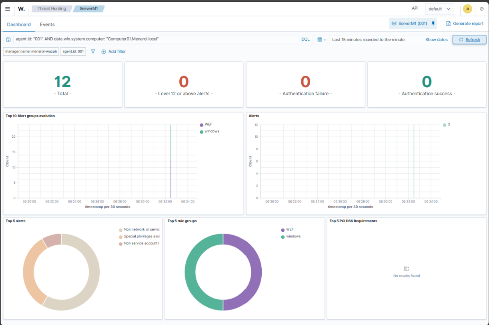
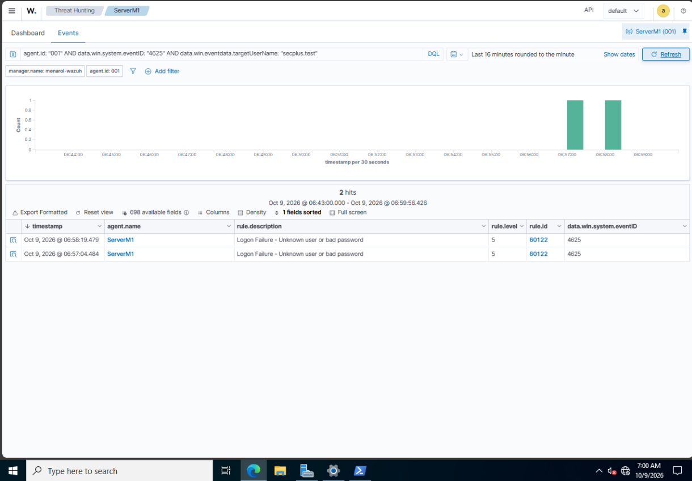
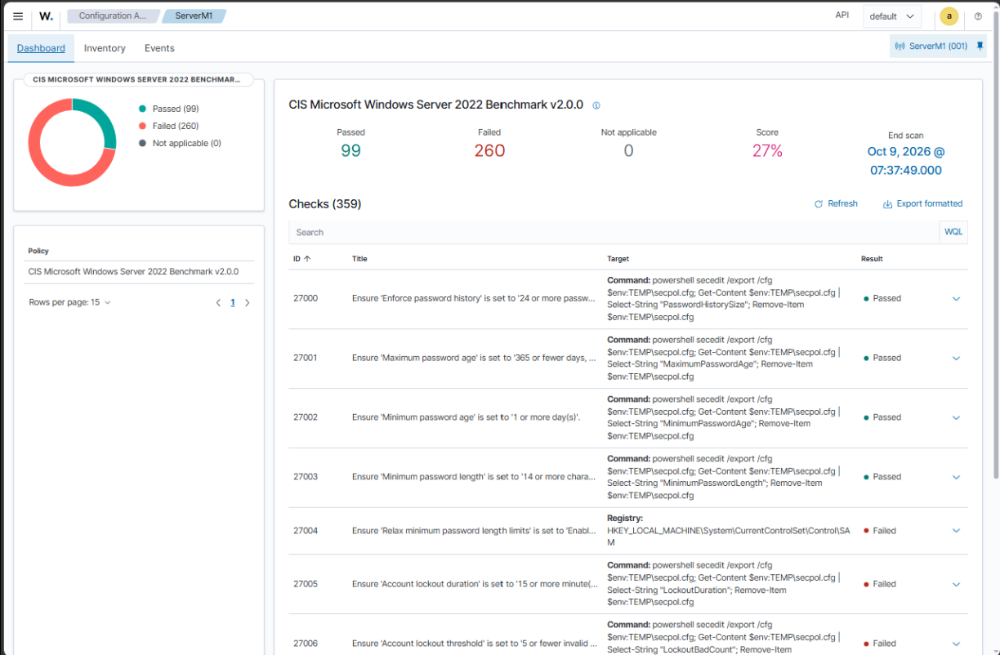
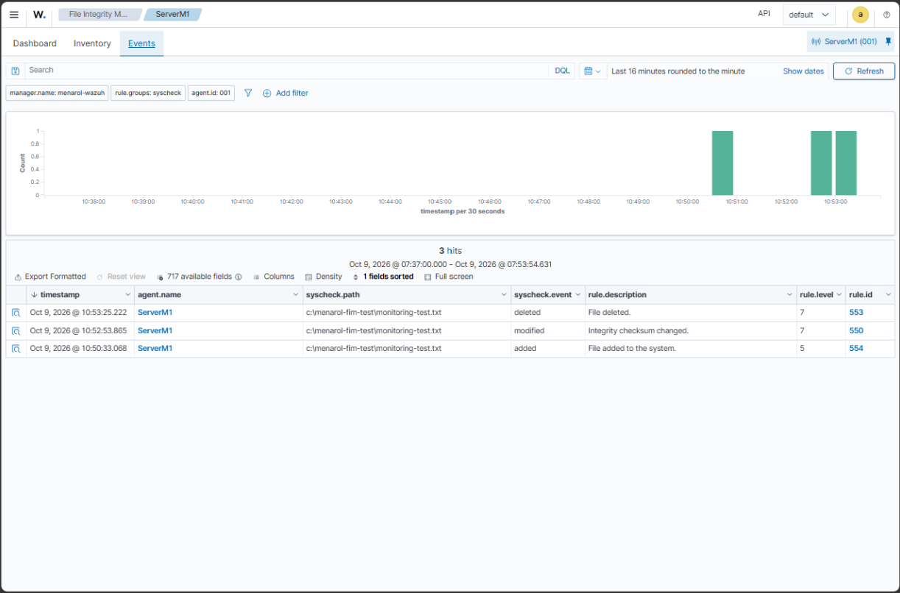

# Windows Security Monitoring and Hardening — Validation Record

**Menarol Enterprise Infrastructure · Pre-production proof of concept · 9 October 2026**

This record covers four tests using the existing VMware, Active Directory, Windows Event Forwarding, and Wazuh setup: event collection, failed-logon alerts, password-policy hardening, and file integrity monitoring.

All test activity was authorised and controlled. These results describe the tested PoC, not production readiness or complete security coverage.

## Validated outcomes

| Exercise | Result | Evidence |
| --- | --- | --- |
| Centralised monitoring | Workstation Security events reached Wazuh through the Windows Event Collector; original source attribution was retained. | [Monitoring overview](evidence/2026-10-09/01-monitoring-overview.png) |
| Authentication monitoring | Two controlled failed-logon records matched Event ID 4625 and Wazuh rule 60122, severity 5. | [Failed-logon alerts](evidence/2026-10-09/02-authentication-alerts.png) |
| Configuration hardening | Default domain minimum password length increased from 7 to 14; Active Directory confirmed the value and SCA check 27003 passed on the final hardening retest. | [Hardening result](evidence/2026-10-09/03-password-hardening-result.png) |
| File integrity monitoring | Creation, modification, and deletion of one harmless local test file produced three distinct Wazuh events. | [File integrity events](evidence/2026-10-09/04-file-integrity-events.png) |

## Architecture and monitoring scope

| System | Role in this validation |
| --- | --- |
| COMPUTER01 | Domain workstation generating selected Windows Security events |
| ServerM1 | Menarol.local domain controller, Windows Event Collector, Wazuh agent 001; local SCA and FIM target |
| MENAROL-WAZUH01 | Wazuh Manager, Indexer, and Dashboard on Ubuntu |

**Windows event path:** COMPUTER01 → Windows Event Forwarding → ServerM1 / ForwardedEvents → Wazuh agent 001 → MENAROL-WAZUH01.

**Configuration assessment and FIM:** performed locally by the agent on ServerM1. Forwarded workstation events do not provide workstation SCA or FIM coverage.

The existing repository records Wazuh 4.14.8, Windows agent 4.14.8-1, and Ubuntu Server 24.04.5 LTS. Installed versions were not independently rechecked during these exercises. Historical MENAROL-SRV01 / menarol.com records remain separate from the operational ServerM1 / Menarol.local baseline.

## 1. Centralised Windows monitoring

The subscription `Menarol Security Events` reported Active, with LastError 0 and an active `Computer01.Menarol.local` source. Recent forwarded events included 4624 and 4672. Wazuh returned matching original-source records through agent 001.

An expanded successful-logon record identified original computer `Computer01.Menarol.local`, Security channel, and Event ID 4624. Its UMFD-0 target represented Windows system activity; it was not presented as a human user's sign-in.



*Twelve records matched the workstation source filter in the displayed time window.*

## 2. Controlled authentication detection

The workstation's Logon audit subcategory was configured for Success and Failure. The default domain lockout threshold was 0 (Never). A dedicated ordinary account, `secplus.test`, was used; an initial correct-password attempt established that it could authenticate, followed by intentionally incorrect-password tests using `runas`.

Windows returned error 1326. The source Security log recorded Event ID 4625 for `secplus.test`, logon type 2, status 0xC000006D, and substatus 0xC000006A. The latter supports a bad-password failure. Wazuh subsequently showed two matching records classified by built-in rule 60122, `Logon Failure - Unknown user or bad password`, severity 5, group `authentication_failed`.



*Two matching failed-logon alerts from an authorised test account. This is detection validation, not evidence of a real attack or brute-force correlation rule.*

### Collection delay investigation

The first 4625 was initially present on COMPUTER01 but absent from the collector and Wazuh. Subscription inspection confirmed 4625 was selected and delivery mode Normal used MaxLatencyTime 900000 milliseconds (15 minutes). A timestamped XML export was saved under `C:\ProgramData\Menarol\WEF-Backups`, then the subscription was changed to MinLatency. Configuration inspection confirmed MaxLatencyTime 30000 milliseconds (30 seconds).

The initial event and a second matching event appeared in Wazuh. The delivery timeout was reduced; precise end-to-end latency improvement was not measured.

## 3. Finding, remediation, and retest

**Finding:** minimum password length was 7 in the default domain policy and the security-policy export; SCA check 27003 required at least 14.

**Initial baseline:** 95 passed / 264 failed, score 26%, across 359 checks. Password history 24, minimum age 1 day, and maximum age 42 days appeared as failures despite matching system evidence.

**Pre-hardening reassessment:** 98 passed / 261 failed, score 27%. A fresh scan corrected those three existing-policy checks without configuration changes.

**Change:** minimum password length was set to 14 in Default Domain Policy. Computer Group Policy was refreshed. `Get-ADDefaultDomainPasswordPolicy` confirmed MinPasswordLength 14 after a server reboot.

**Final hardening retest:** SCA results briefly reverted after that reboot. An agent restart after the system was running produced a new scan with checks 27000–27003 passing. The final scan showed 99 passed / 260 failed, score 27%. One additional check, 27003, changed from failed to passed after minimum password length changed from 7 to 14.



*Check 27003 passed after the minimum-length change. The pre-hardening reassessment and final hardening retest both displayed 27%.*

[Pre-hardening reassessment](evidence/2026-10-09/supporting-assessment-before.png)

The cause of inconsistent scan outcomes around reboot was not established. An agent restart produced a passing reassessment, but no permanent fix was verified.

A GPO SYSVOL/Active Directory permission mismatch was also encountered. GPMC's built-in permission reconciliation was recommended. The editor was subsequently accessible, but independent ACL comparison and the pre-change GPO backup result were not supplied as evidence. Backup completion and independent permission-repair verification remain unconfirmed.

This minimum-length change applies to subsequent password changes/resets; it does not retroactively replace existing passwords. No account-lockout setting was changed. Rollback for this individual change is to restore the previous minimum length of 7 in the same GPO and verify effective policy; assess the security impact before doing so.

## 4. Real-time file integrity monitoring

The existing syscheck configuration was enabled, with a 43200-second scheduled scan. A timestamped copy of `ossec.conf` was prepared before adding a real-time test directory within the existing syscheck block:

```xml
<directories realtime="yes" check_all="yes">C:\Menarol-FIM-Test</directories>
```

The agent log confirmed real-time monitoring of the directory, including hashes and permissions. The scheduled interval was retained. One file, `monitoring-test.txt`, was created, modified, then deleted. Each action was verified before proceeding.

| Action | Wazuh rule | Severity | Observed description |
| --- | --- | --- | --- |
| Added | 554 | 5 | File added to the system. |
| Modified | 550 | 7 | Integrity checksum changed. |
| Deleted | 553 | 7 | File deleted. |



*Three separate events for the same harmless test file demonstrate creation, modification, and deletion detection on ServerM1.*

[Supporting FIM dashboard](evidence/2026-10-09/supporting-file-integrity-dashboard.png)

Wazuh recorded the test file's deletion. The empty directory and monitoring entry remain for demonstrations. The rollback for this addition is to remove that directory entry from syscheck and restart the agent, preserving unrelated settings.

## Concepts used in the tests

| Concept | Practical evidence |
| --- | --- |
| Preventive versus detective controls | Password-length policy prevents nonconforming new passwords; auditing and FIM detect activity. |
| Centralised logging | Separate source generation, event forwarding, collection, and SIEM processing were investigated. |
| Integrity | File hash changes produced a modification alert. |
| Configuration management | System evidence was compared with scan findings before remediation; the policy was retested. |
| Authentication and investigation | Source, account, logon type, failure code, and Wazuh rule were examined. |
| Change management | The previous value, scope, configuration change, validation, and rollback approach were recorded. |

The missing-alert investigation started with the source event, then followed subscription selection, delivery timing, collector ingestion, and Wazuh filtering. The 4625 record existed on COMPUTER01 before the collector received it, which helped narrow the investigation to delivery.

The FIM alerts recorded authorised changes to a test file. They demonstrate change detection; deciding whether a change is malicious would require additional context.

## Cleanup verification — 9 October 2026

Follow-up verification confirms `secplus.test` is disabled (`Enabled=False`) and `C:\Menarol-FIM-Test\monitoring-test.txt` is absent (`Test-Path=False`). The empty demonstration folder and its FIM configuration remain intentionally retained.

This follow-up closes the account/file cleanup item. GPO backup confirmation remains pending.

## Remaining work and limits

- Confirm the GPO backup result and record the actual backup location.
- Preserve timestamps with their source and timezone. Screenshots display differing local times; no normalised latency measurement is claimed.
- Investigate the unresolved SCA inconsistency after reboot.
- Account lockout remains disabled in the default policy; evaluate it separately with usability and denial-of-service implications.
- WEF Security log permission deployment automation remains open from the previous milestone.
- Privileged group changes, PowerShell monitoring, Sysmon, custom detection rules, retention, backup/restore, and production readiness remain future work.
- These tests do not establish CIS compliance or production readiness.

## References

- [Microsoft: WEF delivery and performance](https://learn.microsoft.com/en-us/troubleshoot/windows-server/admin-development/configure-eventlog-forwarding-performance)
- [Microsoft: GPO permission mismatch](https://learn.microsoft.com/en-us/troubleshoot/windows-server/group-policy/permissions-this-gpo-inconsistent)
- [Microsoft: Password policy](https://learn.microsoft.com/windows/security/threat-protection/security-policy-settings/password-policy)
- [Wazuh: Configuration assessment](https://documentation.wazuh.com/current/getting-started/use-cases/configuration-assessment.html)
- [Wazuh: File integrity monitoring](https://documentation.wazuh.com/current/getting-started/use-cases/file-integrity.html)
