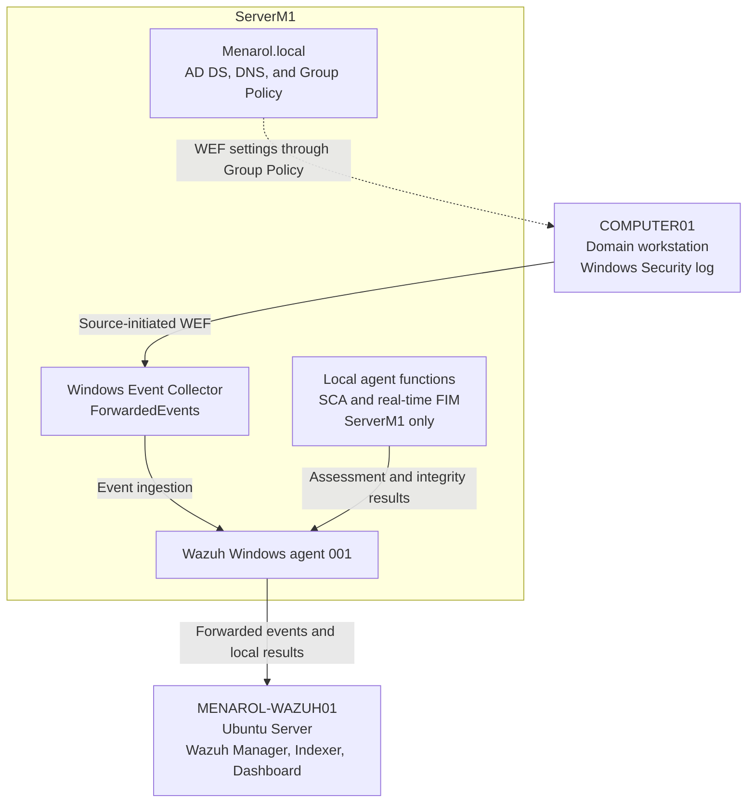

# Security Monitoring Architecture

This diagram shows the collection path in the VMware proof of concept. The ServerM1 box groups roles on the same host. Solid arrows show events and assessment results; the dotted arrow shows workstation forwarding settings delivered through Group Policy.

**Event path:** COMPUTER01 → WEF → ServerM1/WEC → Wazuh agent 001 → MENAROL-WAZUH01. The collection agent identifies ServerM1; original Windows event data identifies `Computer01.Menarol.local`. SCA and FIM are local functions of that agent, not separate machines or workstation assessment coverage.

The [validation record](../02-Implementation-Phases/Phase-03-Enterprise-Security-Monitoring/Validation-2026-10-09.md#architecture-and-monitoring-scope) is authoritative for scope and results. The arrows describe logical data flow; the tests did not establish network addressing, segmentation, or redundancy.

## Verified scope and remaining limits

WEF/WEC collection was verified from COMPUTER01. SCA and FIM were tested only on ServerM1. The empty FIM demonstration folder and configuration remain in place after verified account/file cleanup.

SCA inconsistency after reboot and WEF permission automation remain open. See the [validation record](../02-Implementation-Phases/Phase-03-Enterprise-Security-Monitoring/Validation-2026-10-09.md#remaining-work-and-limits) for the full list of pending work, including GPO backup confirmation and production readiness.

Earlier hostnames remain in the historical phase records; this diagram uses the current documented names.

[Read-only verification runbook](../03-Scripts/README.md) · [Portfolio overview](../05-GitHub-Portfolio/README.md) · [Phase 03](../02-Implementation-Phases/Phase-03-Enterprise-Security-Monitoring/README.md)
